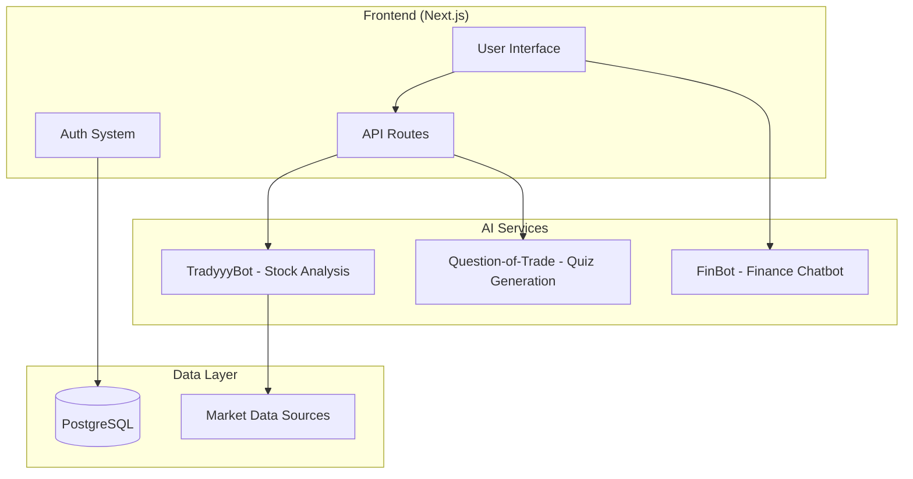

# BullIQ

BullIQ is an AI-driven financial simulation and analysis platform designed to help users learn stock market investing without financial risk. It combines an interactive trading simulator with AI-powered market analysis and educational tooling to help users understand market behavior and decision-making.

The platform consists of a Next.js application that orchestrates multiple Python AI services responsible for stock analysis, quiz generation, and financial assistance.

---

# Architecture

BullIQ follows a service-oriented architecture.

- **Frontend:** Next.js application responsible for UI, orchestration, and API routing  
- **AI Services:** Python microservices providing analysis, quiz generation, and chatbot functionality  
- **Database:** PostgreSQL used for user data, portfolios, and competition state  
- **Market Data:** Historical and intraday datasets used for trading simulations  



---

# Core Features

## AI Stock Analysis

Users can analyze stocks through a multi-agent AI system that evaluates:

- Technical indicators
- Price patterns
- Trend structure
- News sentiment
- Market context
- Financial fundamentals

The system aggregates signals from specialized agents and produces a structured analysis report.

---

## Trading Simulation

BullIQ provides a risk-free trading environment using real market data.

Supported simulation modes:

### Intraday Trading
- Minute-level market data
- High-volatility scenarios

### Long-Term Investing
- Multi-month portfolio simulation
- Fast-forwarding capability

Key functionality:

- Virtual portfolio management
- Market and limit order execution
- Simulated market news
- Performance tracking and leaderboards

---

## Financial Education

BullIQ integrates educational gating to ensure users understand trading risks before accessing advanced features.

Components include:

- AI-generated financial quizzes
- Continuous chatbot assistance
- Interactive explanations of financial concepts

---

# Technology Stack

## Frontend

- Next.js 15
- React 19
- TypeScript
- Tailwind CSS
- shadcn/ui

## Data & Infrastructure

- PostgreSQL
- Drizzle ORM
- Lightweight Charts
- Recharts

## Authentication

- Better Auth

## AI & APIs

- Google Gemini
- Groq (Llama 3.3)
- NewsAPI
- Finnhub
- Alpha Vantage

## Backend Services

- FastAPI-based Python services
- Multi-agent stock analysis pipeline
- Quiz generation service
- Finance chatbot service

---

# Installation

## Prerequisites

- Node.js 18+
- Python 3.9+
- PostgreSQL

---

## Frontend Setup

```bash
git clone <repository-url>
cd bulliq

pnpm install

cp .env.example .env

pnpm db:migrate

pnpm dev
```

---

## Backend Services

### TradyyyBot (Stock Analysis)

```bash
cd agents/TradyyyBot
pip install -r requirements.txt
./run.sh
```

Required environment variables:

```bash
export GEMINI_API_KEY=<key>
export NEWSAPI_KEY=<key>
export FINNHUB_API_KEY=<key>
export ALPHAVANTAGE_API_KEY=<key>
```

---

### FinBot (Chatbot)

```bash
cd agents/TradyyyBot/finbot
pip install -r requirements.txt
uvicorn app.main:app --reload --port 8002
```

---

# API

## Stock Analysis API

Endpoint:

```
POST /api/v1/analyze
```

Example request:

```bash
curl -X POST http://127.0.0.1:5200/api/v1/analyze \
  -H "Content-Type: application/json" \
  -d '{
        "stock_symbol":"RELIANCE",
        "timeframe":"1d",
        "start_date":"2026-03-01 09:15"
      }'
```

---

# Project Structure

```
bulliq/
│
├── src/app/                # Next.js App Router pages
│   ├── discover/
│   ├── compete/
│   ├── knowledge/
│
├── agents/
│   ├── TradyyyBot/
│   │   ├── agents/
│   │   ├── finbot/
│   │   └── reports/
│   │
│   └── Question-of-Trade/
│
├── scripts/
├── package.json
└── README.md
```

---

# Development

## Database Operations

```bash
pnpm db:generate
pnpm db:push
pnpm db:studio
```

## Code Quality

```bash
pnpm check
pnpm lint
pnpm lint:fix
pnpm format:write
```

---

# Multi-Agent Analysis System

The stock analysis engine uses a committee-style multi-agent architecture.

Agents include:

- Indicator Agent
- Pattern Agent
- Trend Agent
- News Agent
- Market Sentiment Agent
- Relative Strength Agent
- US Macro Trend Agent
- Financials Agent
- Confluence Agent
- Risk Agent
- Master Reasoning Agent

Each agent produces an independent signal which is aggregated into a final decision and analysis report.

---

# License

This project is licensed under the MIT License.

---

# Disclaimer

BullIQ is an educational platform. All trading activity is simulated using virtual capital. No real financial transactions occur within the system.
